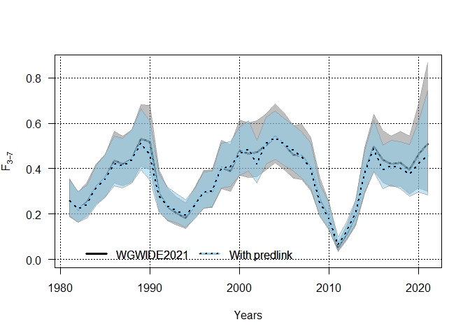
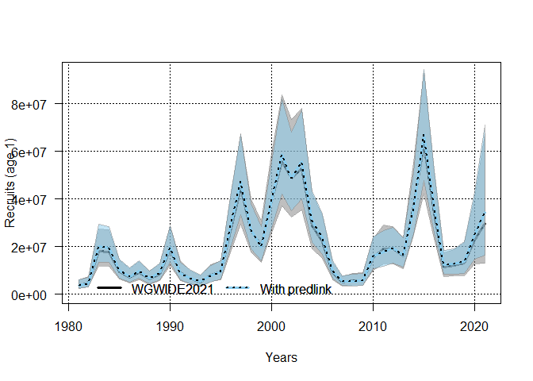

Testing out predlink on Blue Whiting
================

## Blue whiting

``` r
library(stockassessment)
load("code/model/bw/wgwide_fit.Rdata")
load("code/model/bw/fitWithPredlink.Rdata")
ssbplot(c("WGWIDE2021" = fit,
          "With predlink" = fit2),
        addCI = T)
```

<!-- -->

``` r
fbarplot(c("WGWIDE2021" = fit,
          "With predlink" = fit2),
        addCI = T)
```

<!-- -->

``` r
recplot(c("WGWIDE2021" = fit,
          "With predlink" = fit2),
        addCI = T)
```

<!-- -->
